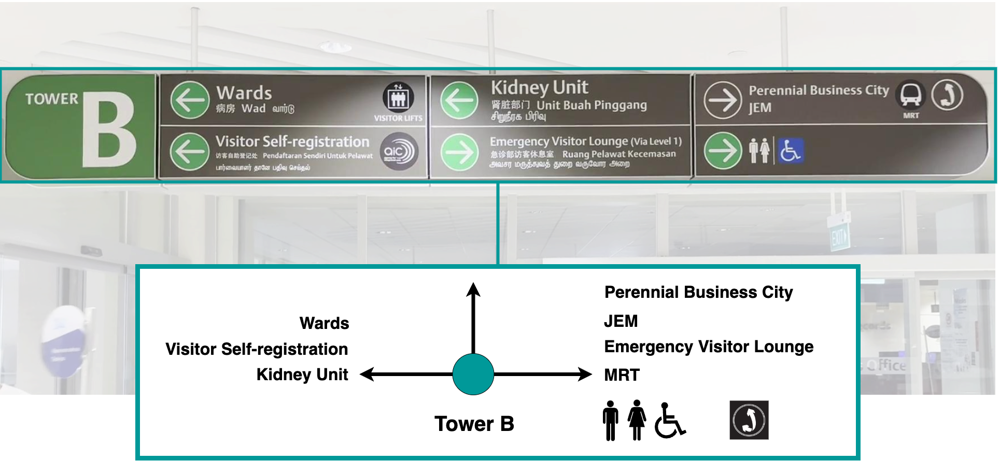
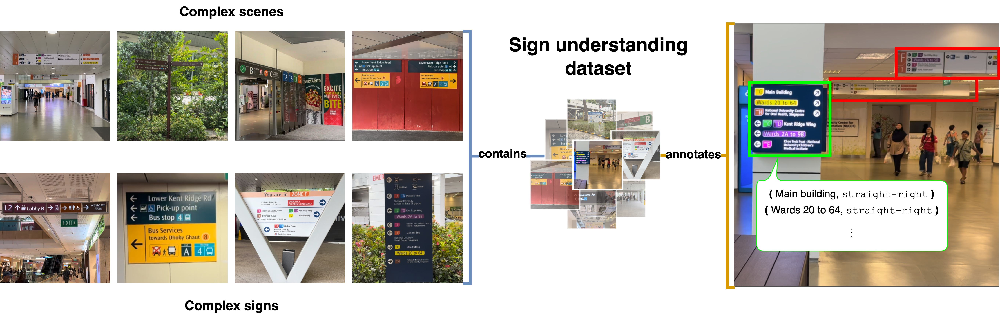

# Sign Language: Towards Sign Understanding for Robot Autonomy

This repository contains the implementation of the following [publication](https://arxiv.org/abs/2506.02556):
```bibtex
@misc{agrawal2025arxiv,
      title={Sign Language: Towards Sign Understanding for Robot Autonomy}, 
      author={Ayush Agrawal and Joel Loo and Nicky Zimmerman and David Hsu},
      year={2025},
      eprint={2506.02556},
      archivePrefix={arXiv},
      primaryClass={cs.RO},
      url={https://arxiv.org/abs/2506.02556}, 
    }
```


## Abstract
Signage is an ubiquitous element of human environments, playing a critical role in both scene understanding and navigation. For autonomous systems to fully interpret human environments, effectively parsing and understanding signs is essential. We introduce the task of navigational sign understanding, aimed at extracting navigational cues from signs that convey symbolic spatial information about the scene. Specifically, we focus on signs capturing directional cues that point toward distant locations and locational cues that identify specific places. To benchmark performance on this task, we curate a comprehensive test set, propose appropriate evaluation metrics, and establish a baseline approach. Our test set consists of over 160 images, capturing signs with varying complexity and design across a wide range of public spaces, such as hospitals, shopping malls, and transportation hubs. Our baseline approach harnesses Vision-Language Models (VLMs) to parse navigational signs under these high degrees of variability. Experiments show that VLMs offer promising performance on this task, potentially motivating downstream applications in robotics. 



## Installation

The baseline requires installing [MobileSAM](https://github.com/IDEA-Research/Grounded-Segment-Anything/tree/main/EfficientSAM) and the following packages
```
pip install pycocotools openai openai-clip
pip install google-generativeai google-ai-generativelanguage google-genai
```
The code was tested on Ubuntu 22.04, with python 3.10, PyTorch 2.5.1 and CUDA 12.1.


## The SiGNgapore Dataset

The dataset is available for download [here](https://drive.google.com/file/d/109mdy1gpIEhyd5JCyNGqdBvrfvgU1tS6/view?usp=sharing). It can also be downloaded from HuggingFace 
```
from datasets import load_dataset_builder
ds_builder = load_dataset_builder("NickyZimmerman/SiGNgapore")
```
It contains 160 images of scenes that include at least one navigational sign, and 205 navigational signs for the recognition task. The images were collected at multiple locations in Singapore, including hospitals, malls, transportation hubs, parks and the NUS campus. The dataset captures various degrees of scene complexity, as well as a wide variety of navigational sign designs. 




The dataset.zip includes an `images` folder and the ground truth json file. The json includes a list of all images, each annotated with bounding boxes for detection. For selected signs, which are human readable and fully visible, we provide the annotation for the recognition task. 

```
{
        "imagePath": "IMG_6524_frame_0022.jpg",
        "annotation": [
            {
                "objectID": 0,
                "boundingBox": [
                    912,
                    416,
                    1720,
                    378
                ],
                "text labels": {
                    "KENT RIDGE WING": "right",
                    "NUHS TOWER BLOCK": "right",
                    "MEDICAL CENTRE": "right",
                    "ZONE A": "locational",
                    "NATIONAL UNIVERSITY CANCER INSTITUTE, SINGAPORE":"right",
                    "PHARMACY@B03-01":"right",
                    "KHOO TECK PUAT-NATIONAL UNIVERSITY CHILDREN'S MEDICAL INSTITUTE":"right",
                    "ZONE B": "right",
                    "ZONE C": "right",
                    "ZONE D": "right",
                    "ZONE E": "right",
                    "ZONE T": "right"
                },
                "symbol labels": {
                    "TOILET": "straight",
                    "PASSENGER LIFTS": "straight"
                }
            },
            {
                "objectID": 1,
                "boundingBox": [
                    796,
                    931,
                    204,
                    40
                ],
                "text labels": {},
                "symbol labels": {}
            }
        ]
    }
```


## Evaluation

Please follow the same repository structure.
Also make sure to export the packages needed in your path
```
export PYTHONPATH=/your/path/to/Sign-Understanding:/your/path/to/Grounded-Segment-Anything/EfficientSAM:/your/path/to/Grounded-Segment-Anything/segment_anything:/your/path/to/Grounded-Segment-Anything/GroundingDINO

```
While running any of the scripts, you should pass the root folder path as an argument
```
python baseline.py --root "/your/path/to/Sign-Understanding/`
```

